# 🏗️ Architecture & Flow Diagrams

## System Architecture

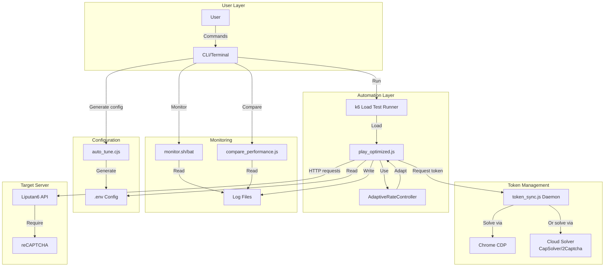

## Request Flow Diagram

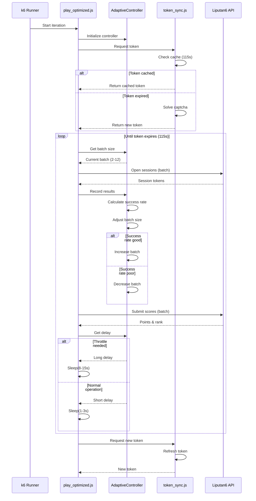

## Adaptive Rate Control Algorithm

```mermaid
stateDiagram-v2
    [*] --> Initializing
    
    Initializing --> Stabilizing: Start with initial batch
    
    Stabilizing --> Accelerating: 3+ successes + SR >= 75%
    Stabilizing --> Growing: 2+ successes + SR >= 67%
    Stabilizing --> Slowing: SR < 75%
    Stabilizing --> Decelerating: 2+ errors
    
    Accelerating --> Stabilizing: Batch += 2
    Accelerating --> Decelerating: Error detected
    
    Growing --> Stabilizing: Batch += 1
    Growing --> Decelerating: Error detected
    
    Slowing --> Stabilizing: Batch -= 1
    Slowing --> Decelerating: More errors
    
    Decelerating --> Stabilizing: Batch *= 0.6
    Decelerating --> Cooldown: Serious errors
    
    Cooldown --> Stabilizing: Cooldown expired
    
    state Accelerating {
        [*] --> CheckSuccess
        CheckSuccess --> IncreaseBatch: SR >= 75%
        IncreaseBatch --> ReduceCooldown
        ReduceCooldown --> [*]
    }
    
    state Decelerating {
        [*] --> CheckErrors
        CheckErrors --> ReduceBatch: Errors >= 2
        ReduceBatch --> IncreaseCooldown
        IncreaseCooldown --> [*]
    }
```

## Error Handling Flow

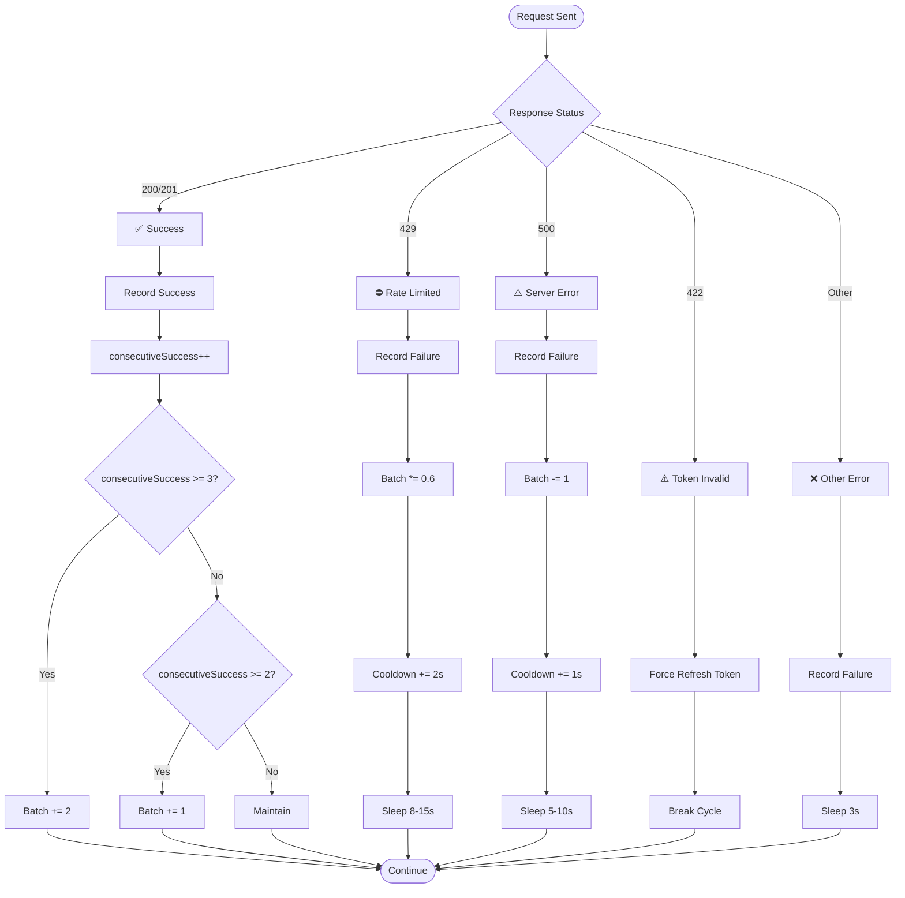

## Token Lifecycle

```mermaid
gantt
    title Token Captcha Lifecycle (120s validity)
    dateFormat  ss
    axisFormat %S
    
    section Token 1
    Solving captcha     :t1_solve, 00, 10s
    Active usage       :active, t1_active, after t1_solve, 115s
    Grace period       :crit, t1_grace, after t1_active, 5s
    
    section Rounds
    Round 1            :r1, 10, 8s
    Delay              :d1, after r1, 2s
    Round 2            :r2, after d1, 8s
    Delay              :d2, after r2, 2s
    Round 3            :r3, after d2, 8s
    Delay              :d3, after r3, 2s
    Round 4            :r4, after d3, 8s
    ...                :milestone, after r4, 0s
    
    section Token 2
    Refresh at 115s    :milestone, 125, 0s
```

## Performance Optimization Impact

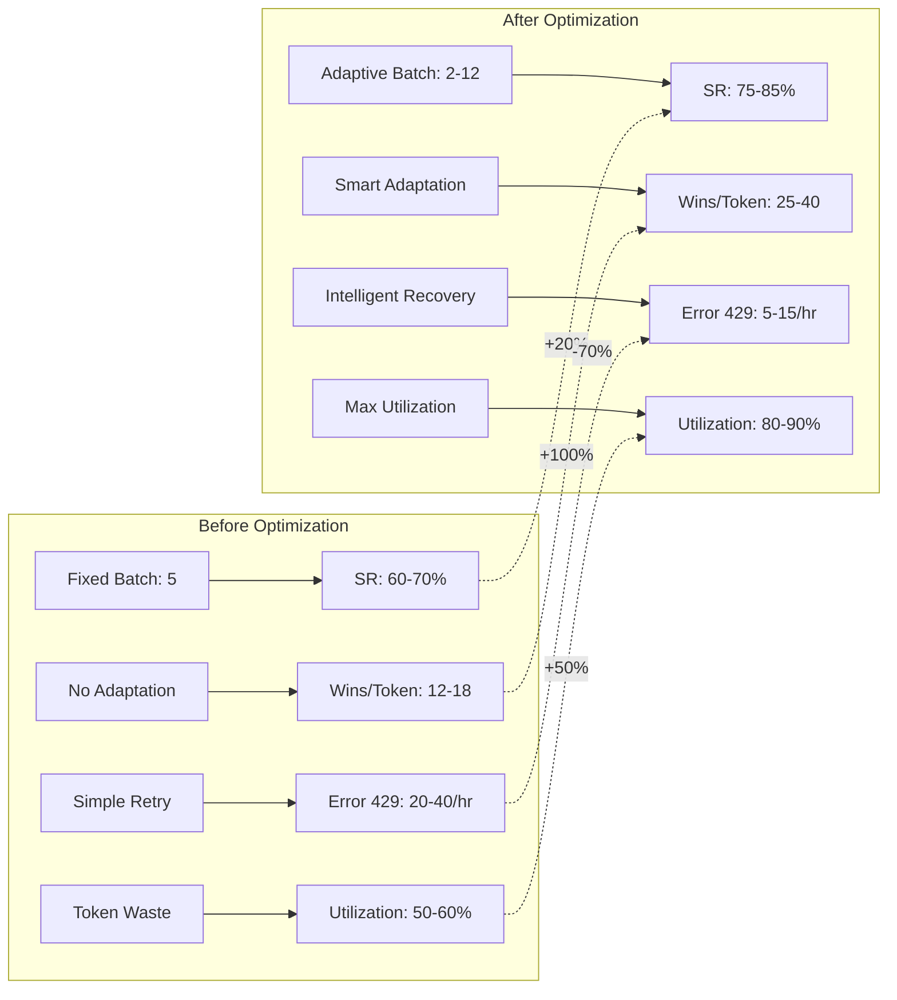

## Configuration Tuning Matrix

```mermaid
quadrantChart
    title Configuration Strategy Matrix
    x-axis Low Throughput --> High Throughput
    y-axis Low Safety --> High Safety
    
    quadrant-1 Balanced (Recommended)
    quadrant-2 Maximum Safety
    quadrant-3 Ultra Conservative
    quadrant-4 Maximum Speed
    
    "Default Config": [0.65, 0.55]
    "Fast Network + Off-Peak": [0.85, 0.45]
    "Slow Network + Peak": [0.35, 0.75]
    "Getting Errors": [0.25, 0.85]
    "High Performance": [0.75, 0.65]
    "Avoiding Ban": [0.15, 0.95]
```

## Data Flow Architecture

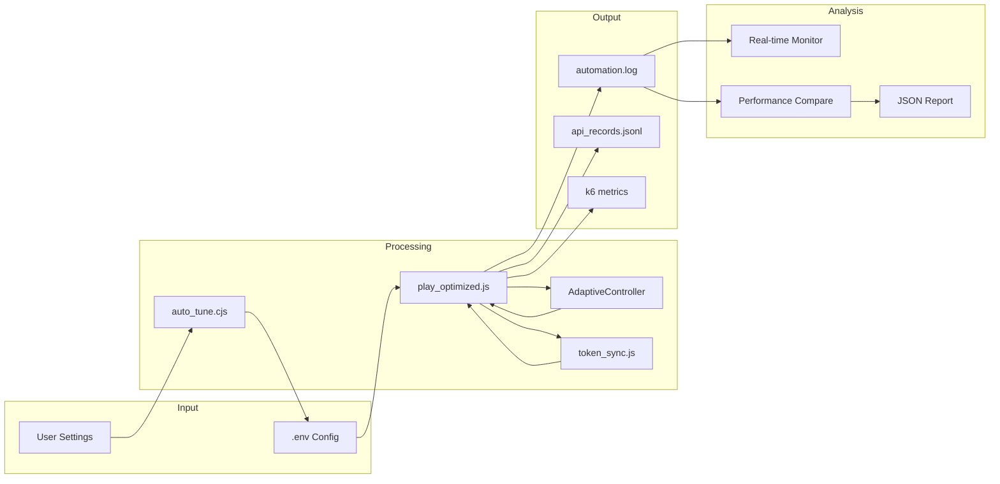

## Success Rate Tracking Window

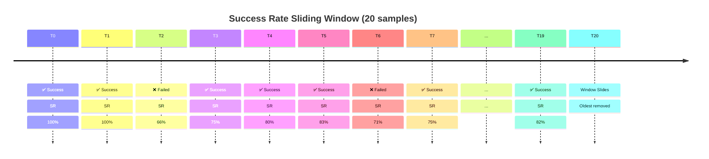

## Deployment Architecture

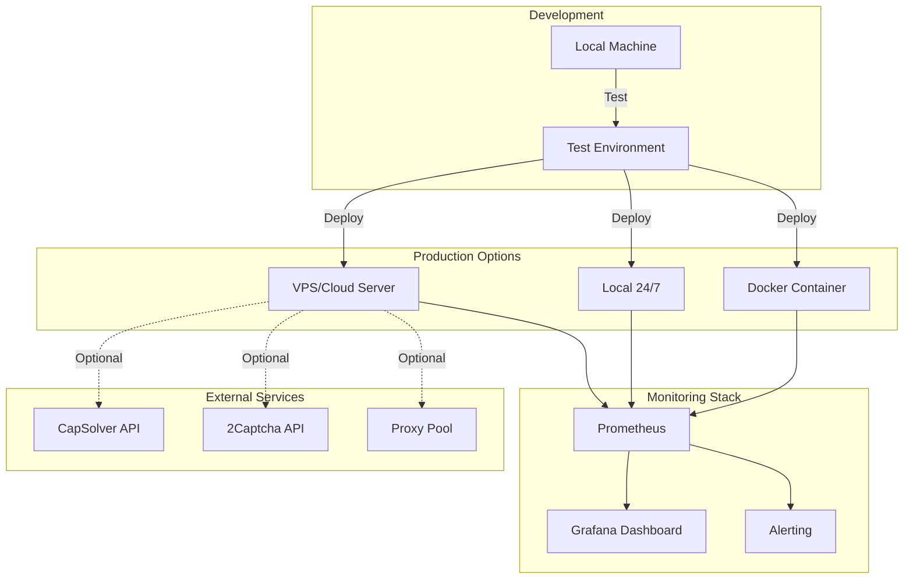

## Rate Limiting State Machine

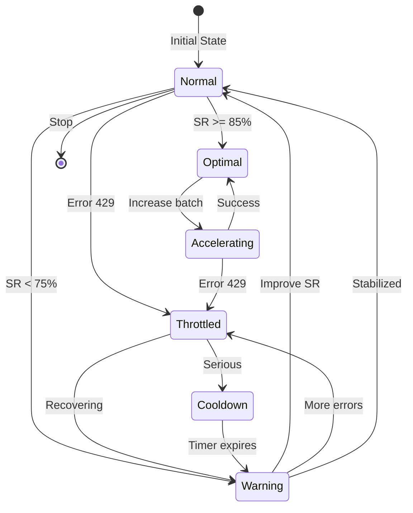

## Component Interaction

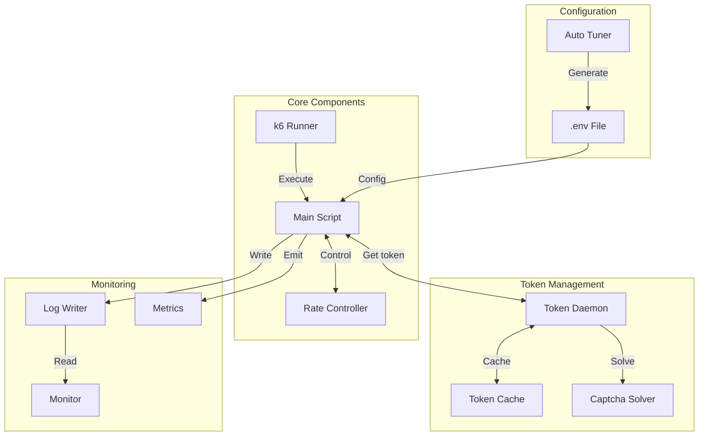

---

## Key Metrics Dashboard Layout

```
┌─────────────────────────────────────────────────────────────────┐
│  🚀 Real-time Performance Dashboard                             │
├─────────────────────────────────────────────────────────────────┤
│                                                                 │
│  Performance Metrics:                                           │
│  ────────────────────────────────────────────────────────────  │
│    ✓ Total Wins:          287                                  │
│    ● Cycles:               12                                   │
│    📈 Success Rate:        82.3%  [████████░░] 🟢 EXCELLENT    │
│    💎 Wins per Cycle:      23.9                                 │
│    ⚡ Avg Batch Size:      7.2                                  │
│                                                                 │
│  Error Statistics:                                              │
│  ────────────────────────────────────────────────────────────  │
│    ⛔ Error 429:          7      [█░░░░░░░░░] 🟢 LOW          │
│    ⚠️  Error 500:          3      [░░░░░░░░░░] 🟢 VERY LOW     │
│                                                                 │
│  System Status:                                                 │
│  ────────────────────────────────────────────────────────────  │
│    🏆 EXCELLENT - System performing optimally                  │
│                                                                 │
│  Current Strategy:                                              │
│  ────────────────────────────────────────────────────────────  │
│    State:        ACCELERATING                                   │
│    Batch:        8 (trending ⬆)                                │
│    Delay:        1.2s (optimal)                                 │
│    Cooldown:     0s                                             │
│                                                                 │
└─────────────────────────────────────────────────────────────────┘
```

---

## System States Overview

| State | Batch Size | Delay | SR Target | Trigger |
|-------|-----------|-------|-----------|---------|
| **INITIALIZING** | Initial (8) | Normal | 75% | Start |
| **STABILIZING** | Maintain | Normal | 75% | Default |
| **ACCELERATING** | +2 | Short | 75% | 3+ success + SR ≥ 75% |
| **GROWING** | +1 | Short | 75% | 2+ success + SR ≥ 67% |
| **SLOWING** | -1 | Normal | 75% | SR < 75% |
| **DECELERATING** | ×0.6 | Long | 80% | 2+ errors |
| **COOLDOWN** | Min | Max | 85% | Serious errors |

---

**Architecture designed for:**
- 🎯 Maximum reliability
- ⚡ Optimal performance  
- 🔄 Self-adaptation
- 📊 Full observability
- 🛡️ Error resilience
