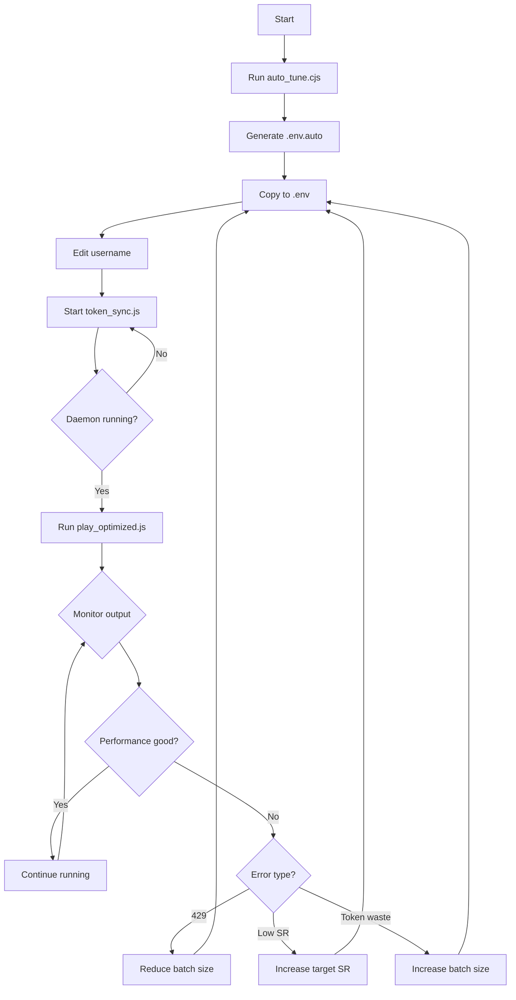

# 🚀 Quick Reference Card

## 📋 Commands Cheat Sheet

```bash
# 1️⃣ Auto-generate optimal config
node auto_tune.cjs

# 2️⃣ Start token sync daemon
node token_sync.js

# 3️⃣ Run optimized script with monitoring
k6 run play_optimized.js 2>&1 | tee automation_optimized.log

# 4️⃣ Monitor in separate terminal
./monitor.sh           # Linux/Mac
monitor.bat            # Windows

# 5️⃣ Compare performance
node compare_performance.js
```

---

## ⚙️ Configuration Quick Reference

### 🎯 Balanced (Default)
```env
INITIAL_BATCH_SIZE=8
MIN_BATCH_SIZE=2
MAX_BATCH_SIZE=12
TARGET_SUCCESS_RATE=0.75
MIN_ROUND_DELAY_SEC=1.0
MAX_ROUND_DELAY_SEC=3.0
AGGRESSIVE_MODE=true
```

### 🚀 Maximum Speed (Fast Network + Off-Peak)
```env
INITIAL_BATCH_SIZE=12
MIN_BATCH_SIZE=4
MAX_BATCH_SIZE=20
TARGET_SUCCESS_RATE=0.65
MIN_ROUND_DELAY_SEC=0.5
MAX_ROUND_DELAY_SEC=2.0
AGGRESSIVE_MODE=true
```

### 🛡️ Maximum Safety (Slow Network or Peak Hours)
```env
INITIAL_BATCH_SIZE=4
MIN_BATCH_SIZE=1
MAX_BATCH_SIZE=6
TARGET_SUCCESS_RATE=0.85
MIN_ROUND_DELAY_SEC=2.0
MAX_ROUND_DELAY_SEC=5.0
AGGRESSIVE_MODE=false
```

### 🐌 Ultra Conservative (Avoiding Bans)
```env
INITIAL_BATCH_SIZE=2
MIN_BATCH_SIZE=1
MAX_BATCH_SIZE=4
TARGET_SUCCESS_RATE=0.90
MIN_ROUND_DELAY_SEC=3.0
MAX_ROUND_DELAY_SEC=6.0
AGGRESSIVE_MODE=false
```

---

## 📊 Understanding Output

### Success Log
```
[VU1|#5] ✅ +150pts | Batch: 5/5 (100%) | Size: 8 | SR: 82.3% | Rank: #123 | Total: 12500
         ↑           ↑                     ↑        ↑            ↑              ↑
      Points    Success/Total     Current Batch  Success    Leaderboard    Total Score
                  (Rate)              Size         Rate       Ranking
```

### Performance Indicators

| Metric | 🏆 Excellent | ✅ Good | ⚠️ Warning | ❌ Poor |
|--------|-------------|---------|-----------|---------|
| Success Rate | > 85% | 70-85% | 50-70% | < 50% |
| Batch Size | 8-12 | 5-8 | 3-5 | 1-3 |
| Error 429/hour | < 5 | 5-15 | 15-30 | > 30 |
| Wins per Cycle | > 35 | 25-35 | 15-25 | < 15 |
| Token Utilization | > 85% | 70-85% | 50-70% | < 50% |

---

## 🔧 Troubleshooting Flowchart

```
Start
  │
  ├─ Error 429 > 20?
  │   ├─ YES → Reduce batch size by 50%
  │   │       → Increase delays by 50%
  │   │       → Set AGGRESSIVE_MODE=false
  │   │       → Restart
  │   └─ NO → Continue
  │
  ├─ Success Rate < 60%?
  │   ├─ YES → Increase TARGET_SUCCESS_RATE to 0.85
  │   │       → Add 1s to MIN_ROUND_DELAY_SEC
  │   │       → Reduce batch size by 30%
  │   │       → Restart
  │   └─ NO → Continue
  │
  ├─ Wins per Cycle < 20?
  │   ├─ YES → Check if throttling too much
  │   │       → If SR > 80% and errors low:
  │   │       →   Increase batch size by 20%
  │   │       →   Reduce delays by 20%
  │   │       → Restart
  │   └─ NO → Continue
  │
  └─ All Good → Monitor and enjoy! 🎉
```

---

## 🚨 Error Messages & Solutions

| Error | Meaning | Solution |
|-------|---------|----------|
| `429 Rate Limit` | Too many requests | Reduce batch size, increase delays |
| `500 Server Error` | Server overload | Temporary, script will retry with backoff |
| `422 Token expired` | Captcha token invalid | Auto-refresh, no action needed |
| `Google Cooldown aktif` | IP rate limited by Google | Wait 90s, script handles automatically |
| `Token Sync error` | Daemon not running | Check if `node token_sync.js` is running |

---

## 💡 Pro Tips

### 1. Optimal Running Times
- 🌙 **Best**: 00:00-06:00 (off-peak, server sepi)
- ☀️ **Good**: 09:00-15:00 (normal hours)
- 🚫 **Avoid**: 18:00-23:00 (peak, banyak user)

### 2. Quick Adjustments While Running

**Too many 429 errors appearing?**
→ Edit `.env` → Reduce `INITIAL_BATCH_SIZE` to 4 → Save → Script will auto-adjust next cycle

**Success rate dropping?**
→ Edit `.env` → Set `TARGET_SUCCESS_RATE=0.85` → Save → Script will slow down

**Token underutilized?**
→ Edit `.env` → Set `AGGRESSIVE_MODE=true` → Increase `MAX_BATCH_SIZE` to 15 → Save

### 3. Multiple Accounts
```bash
# Terminal 1: Account A
MINIGAMES_USERNAME=account_a k6 run play_optimized.js

# Terminal 2: Account B  
MINIGAMES_USERNAME=account_b k6 run play_optimized.js

# Use different ports for token sync daemon
PORT=9876 node token_sync.js &  # Account A
PORT=9877 node token_sync.js &  # Account B
```

### 4. Cloud Solver Integration
```env
# Add to .env for unlimited solving without IP limits
CAPSOLVER_API_KEY=your_capsolver_key_here

# Then can use more aggressive settings:
INITIAL_BATCH_SIZE=15
MAX_BATCH_SIZE=25
```

---

## 📈 Expected Performance Benchmarks

### Conservative Mode (Safety First)
- Batch Size: 2-4
- Success Rate: 85-95%
- Wins per Token: 15-25
- Error Rate: < 1%

### Balanced Mode (Recommended)
- Batch Size: 4-8
- Success Rate: 75-85%
- Wins per Token: 25-35
- Error Rate: 2-5%

### Aggressive Mode (Maximum Throughput)
- Batch Size: 8-15
- Success Rate: 65-80%
- Wins per Token: 35-50
- Error Rate: 5-10%

---

## 🔄 Workflow Diagram



---

## 📞 Quick Help

### Log Files Location
- Main log: `automation_optimized.log`
- Token sync: `token_sync.log`
- API records: `api_records.jsonl`
- Performance report: `performance_report.json`

### Important Files
- `play_optimized.js` - Main script (DON'T EDIT)
- `.env` - Configuration (EDIT THIS)
- `token_sync.js` - Captcha solver daemon
- `auto_tune.cjs` - Auto config generator
- `compare_performance.js` - Performance analyzer

### Getting Help
1. Check `OPTIMIZATION_GUIDE.md` for detailed explanations
2. Run `node auto_tune.cjs` for optimal config
3. Use `monitor.sh`/`monitor.bat` for real-time stats
4. Run `node compare_performance.js` to analyze performance

---

## 🎯 Quick Decision Matrix

**Choose configuration based on:**

| Condition | Config Type | Expected Wins/Token |
|-----------|-------------|---------------------|
| Fast network + Off-peak | Maximum Speed | 40-50 |
| Fast network + Peak hours | Balanced | 30-40 |
| Normal network + Off-peak | Balanced | 25-35 |
| Normal network + Peak | Conservative | 20-30 |
| Slow network + Any time | Ultra Conservative | 15-25 |
| Getting 429 errors | Safety First | 10-20 |

---

**Print this page and keep it handy! 📌**
